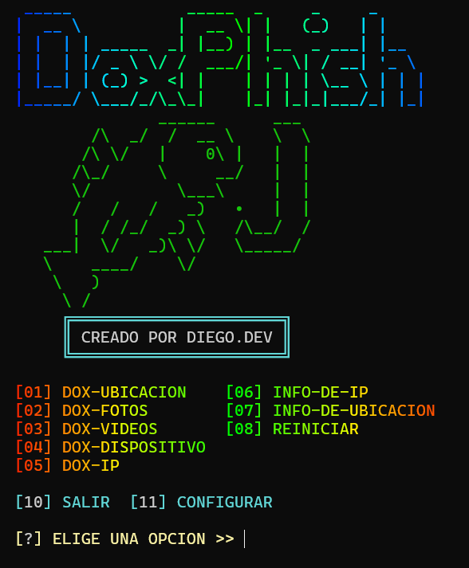

# DoxPhish
como principiante en prgramacion con python, he creado esta herramineta donde puedes lanzar 5 diferentes tipos de phishing en tu equipo local, cada uno lo puedes configurar a tu gusto.

Utiliza esta herramienta con responsabilidad, nadie se hara cargo de las cosas indevidas que haces con ella

)
### Clonar el repositorio para termux
```sh
pkg update && pkg upgrade -y
pkg install git -y
pkg install python -y
git clone https://github.com/DIEGODEVPY/DoxPhish
cd DoxPhish
python DoxPhish.py
